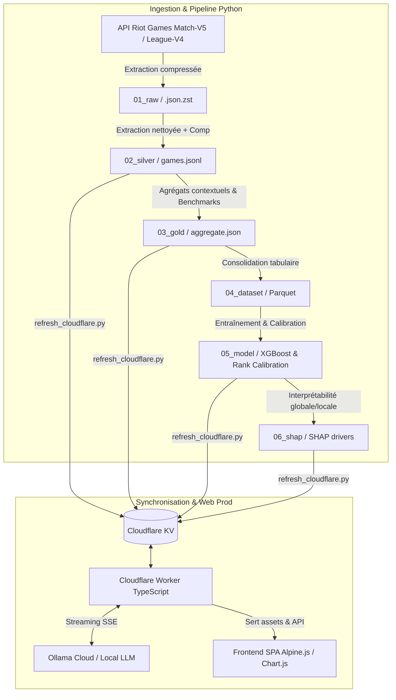

# Coaching LoL 🎯 — Coach IA & Pipeline Data/ML pour League of Legends

[](https://www.python.org/)
[](https://python-poetry.org/)
[](https://workers.cloudflare.com/)
[](https://xgboost.readthedocs.io/)
[](https://www.typescriptlang.org/)
[](https://opensource.org/licenses/MIT)

> **Un coach IA personnalisé centré sur les décisions du joueur, le macro-positionnement et la chaîne causale des événements, benchmarké par rapport aux données réelles de joueurs Challenger / Master.**

---

## 🌟 Pourquoi ce projet ?

Les outils d'analyse traditionnels de League of Legends (OP.GG, U.GG, Porofessor) reposent quasi exclusivement sur des **agrégats naïfs** (KDA, CS/min, dégâts bruts, taux de victoire). Ces métriques mènent trop souvent à des conseils creux ou erronés (*« meurs moins »*, *« farme plus »*).

**Coaching LoL** prend le contre-pied :
1. **Positionnement > Stats brutes** : Une analyse temporelle précise (à partir de la timeline Riot Match-V5) des déplacements, du timing de recall, de la proximité aux objectifs et de l'isolement apporte un signal bien plus déterminant qu'un simple score KDA.
2. **Respect strict de l'asymétrie d'information** : Le coach ne reproche **JAMAIS** une décision sur la base d'une information que le joueur n'avait pas (fog of war). Les features sont scindées entre métriques fiables pour le coaching (`COACHING_SAFE`) et proxies de vision réservés au ML (`ML_ONLY`).
3. **Benchmarks comparatifs High-Elo** : Tout diagnostic est contextualisé par rapport à des dizaines de milliers de parties Challenger et Master à issue équivalente (victoire vs défaite, matchup botlane, exposition aux ganks).
4. **Analyse causale post-mort** : Chaque mort est reliée mécaniquement à ses conséquences objectives (bâtiments perdus, drakes/barons cédés, swing de gold d'équipe dans les 60 à 90 secondes suivantes).
5. **Restitution structurée par LLM** : Le modèle de langage ne fait pas de calculs "au doigt mouillé" ; il reçoit un **payload pré-agrégé et vérifié**, et produit une analyse narrative structurée (forces, erreurs étayées par des preuves chiffrées, habitudes à corriger, focus prioritaire).

---

## 🏗️ Architecture Globale

Le projet repose sur une **architecture Médaillon** en Python (pour l'extraction, l'ingénierie des données et le ML) couplée à une **application web Cloudflare Worker** (TypeScript + KV + Alpine.js) pour la restitution web en temps réel. **Aucun backend FastAPI ne tourne en production** : le calcul lourd est fait en amont en Python local et synchronisé dans Cloudflare KV, ce qui permet au Worker de servir l'API et les pages avec une empreinte CPU minimale (< 10 ms).



---

## 📂 Organisation du Dépôt & Médaillon

```text
coaching_lol/
├── src/
│   ├── core/                  # Socle partagé (client Riot, positionnement, journal, features)
│   ├── collection/            # Scripts de scraping, densification et sync Cloudflare
│   ├── pipeline_ops/          # Maintenance médaillon (re-extraction, rebuild, zstd, audits)
│   ├── reporting/             # Comparateur heuristique de profils vs référentiels
│   ├── 01_data_engineering/   # Construction des tables ML Parquet
│   ├── 02_data_science/       # Modèles de classification de rang, régression LP, calibration
│   ├── 03_data_analyse/       # Analyse d'impact SHAP / Explainability
│   └── 04_coaching/           # Génération des prompts, validation Pydantic et client LLM
├── data/                      # Stockage des couches de données (gitignoré sauf statiques)
│   ├── 00_static/             # Caractéristiques des champions et validation d'axes
│   ├── 01_raw/                # Matchs bruts Riot compressés en Zstandard (.json.zst)
│   ├── 02_silver/             # Jeux de données nettoyés par joueur / référentiel
│   ├── 03_gold/               # Agrégations de benchmark par rôle, champion et contexte
│   ├── 04_dataset/            # Datasets Parquet prêts pour le machine learning
│   ├── 05_model/              # Modèles entraînés (.pkl) et métriques de calibration
│   └── 06_shap/               # Explications SHAP locales et globales
├── web/
│   ├── cf/                    # Cloudflare Worker TypeScript (API, KV & SSE de production)
│   ├── frontend/              # Interface SPA statique servie par le Worker
│   └── backend/               # [Archivé/Legacy] Ancien backend FastAPI pré-Cloudflare (Fly.io)
└── tests/                     # Suite de tests automatisés pytest & vitest
```

---

## 🔬 Fonctionnalités Clés & Méthodologie

### 1. Ingestion Riot & Compression Zstandard
- Utilisation de **Match-V5 + Timeline** pour capturer chaque événement discret et l'échantillonnage 60s des 10 champions.
- Compression transparente en `.json.zst` permettant de stocker des milliers de parties complètes (~10 Go brut $\rightarrow$ ~750 Mo).
- Rate-limiting adaptatif et routage automatique (régional pour Account/Match, plateforme pour League/Rank).

### 2. Macro-Positionnement & Respect de l'Asymétrie
- **14 features `COACHING_SAFE`** : Distance médiane aux alliés, distance d'isolement, temps passé en base, timing de reset, gold non dépensé moyen avant recall, proximité aux drakes et barons avant spawn...
- **3 features `ML_ONLY`** (proxies de vision) : Utilisées uniquement par les modèles prédictifs, jamais reprochées au joueur afin d'éviter tout biais omniscient.
- **Contexte de Lane & Matchup** : Classification automatique de la composition botlane (`poke`, `all_in`, `scaling`, `mixed`) et calcul de l'exposition aux ganks (`low`, `med`, `high`).

### 3. Machine Learning & Estimation de Rang
- **Classification de niveau** : Prédiction probabiliste du rang effectif (High Elo Challenger/Master vs Low Elo) entraînée sur les profils agrégés de joueurs (`build_player_dataset.py`, XGBoost / LightGBM).
- **Régression de LP** : Modèle calibré estimant le niveau en League Points continus.
- **Interprétabilité SHAP** : Extraction des leviers de progression spécifiques au joueur (SHAP values indiquant précisément quelles habitudes freinent la montée en elo).

### 4. Restitution LLM Fiabilisée & Streaming SSE
- Payload rigoureusement formaté contenant les signaux statistiques et le contexte de jeu.
- Sortie contrainte par un **schéma JSON strict** :
  - `strengths` (3 points forts avec preuves chiffrées).
  - `mistakes` (3 erreurs clés avec preuves chiffrées).
  - `habits` (2 axes récurrents à corriger).
  - `next_focus` (1 objectif actionnable pour la prochaine partie).
- Diffusion en direct vers le frontend via **Server-Sent Events (SSE)**.
- **Boucle de feedback** intégrée pour évaluer l'utilité des recommandations générées.

---

## 🚀 Installation & Démarrage Rapide

### Prérequis
- **Python 3.11+** avec [Poetry](https://python-poetry.org/)
- **Node.js 20+** et `npm`
- Une clé API Riot Games ([Riot Developer Portal](https://developer.riotgames.com/))

### 1. Cloner le projet & Installer les dépendances

```bash
git clone https://github.com/JeanVG23/coaching_lol.git
cd coaching_lol

# Installer l'environnement Python
poetry install

# Installer les dépendances du Worker Cloudflare
cd web/cf
npm install
cd ../..
```

### 2. Configuration des variables d'environnement

Copiez le fichier d'exemple et renseignez vos identifiants :

```bash
cp .env.example .env
```

Variables requises dans `.env` :
```env
RIOT_API_ID=RGAPI-xxxxxxxx-xxxx-xxxx-xxxx-xxxxxxxxxxxx
RIOT_ID=MonPseudo#EUW
RIOT_REGION=euw1

# Pour la synchronisation Cloudflare KV (optionnel en local)
CF_API_TOKEN=votre_token_cloudflare
CF_ACCOUNT_ID=votre_account_id
CF_NAMESPACE_ID=votre_kv_namespace_id

# Pour le coaching LLM
OLLAMA_API_KEY=votre_cle_ollama
```

---

## 💻 Utilisation & Commandes Principales

### Pipeline de Données & Scraping

```bash
# 1. Collecter des parties pour un référentiel de rang (ex: challenger)
poetry run python src/collection/build_referential.py --region euw1 --rank challenger --players 20

# 2. Agréger les données d'un joueur local
poetry run python src/collection/aggregate_games.py --slug monjoueur -n 30

# 3. Comparer son profil au référentiel Challenger
poetry run python src/reporting/compare.py --player monjoueur --scope adc --target challenger

# 4. Construire le dataset Parquet pour le ML
poetry run python src/01_data_engineering/build_player_dataset.py

# 5. Entraîner le modèle de prédiction de rang
poetry run python src/02_data_science/train_player_ensemble.py
```

### Lancement de l'Application Web

L'application web s'exécute via le **Worker Cloudflare TypeScript** (`web/cf/`) qui sert l'API sous `/api/*`, le binding KV (`DATA`) et les assets statiques du frontend Alpine.js (`web/frontend/`) :

```bash
cd web/cf

# Lancement en local avec lecture des données Cloudflare KV distantes :
npx wrangler dev --remote
```

L'application est accessible en local sur `http://localhost:8787` (et déployée en production sur `https://coaching-lol.jeanvg.fr`).

> ℹ️ **Note d'architecture** : L'ancien backend Python/FastAPI (`web/backend/`) hérité de l'ancien hébergement Fly.io a été retiré de la chaîne active et archivé. Le site et l'API tournent exclusivement sur Cloudflare Worker TypeScript.

---

## 🧪 Tests & Assurance Qualité

Le projet intègre une suite de tests unitaires et de cohérence pour garantir la parité stricte entre les pipelines Python et TypeScript :

```bash
# Lancer les tests Python (pytest)
poetry run pytest tests/web/
poetry run pytest tests/ -k "not pretrain"

# Lancer les tests TypeScript (vitest)
npm test --prefix web/cf

# Vérification du typage TypeScript
npm run --prefix web/cf typecheck
```

---

## 🔒 Confidentialité & Hygiène des Données

- **Pas de données brutes versionnées** : Les fichiers volumineux de timeline (`data/01_raw/`, `data/02_silver/`, etc.) ainsi que les fichiers d'environnement `.env` sont strictement exclus par `.gitignore`.
- **Fixtures de test anonymisées** : Les jeux de données présents dans `tests/web/fixtures/` sont des fixtures synthétiques minimales conçues pour valider les endpoints de l'API et les parsers sans dépendre de données réelles.
- **Gestion des comptes** : `web/backend/accounts.json` n'est pas versionné — les comptes suivis sont des données personnelles. Copiez `web/backend/accounts.example.json` pour créer le vôtre ; à défaut, l'application démarre sur l'exemple.

---

## 📜 Licence

Ce projet est sous licence [MIT](LICENSE).
